# Polarity Microsoft Azure Data Explorer Integration

Polarity's Azure Data Explorer integration can search your Azure Data Explorer cluster using a custom Kusto (KQL) query.

| 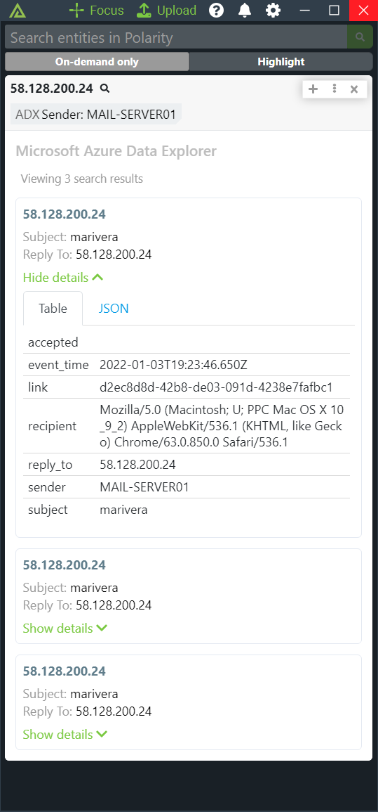 | 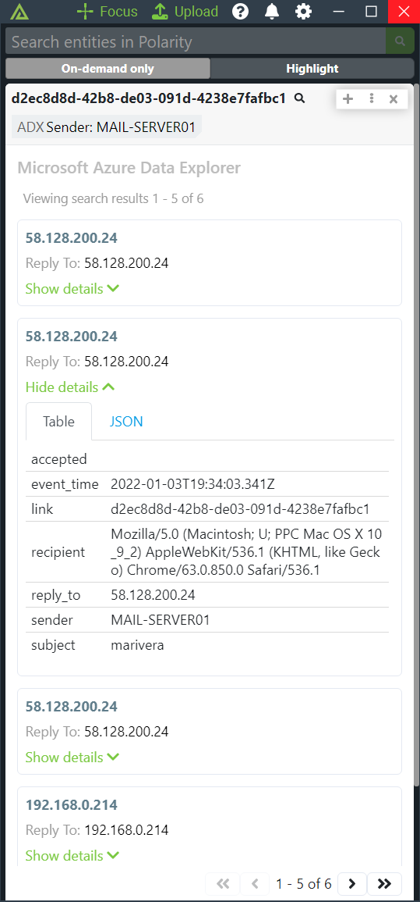 |
|----------------------------|--------------------------------|
| *IP Lookup*                | *Support Custom Data Types*    |

## Azure Data Explorer Integration Options

### Azure Data Explorer Cluster URL
The Azure Data Explorer Cluster URL. Should be of the format `https://<your-cluster-name>.<region>.kusto.windows.net`

### Azure AD Registered App Client/Application ID
Your Azure AD Registered App's Client ID associated with your Azure Data Explorer Instance.

### Azure AD Registered App Tenant/Directory ID
Your Azure AD Registered App's Tenant ID associated with your Azure Data Explorer Instance.

### Azure AD Registered App Client Secret Value
Your Azure AD Registered App's Client Secret associated with your Azure Data Explorer Instance.

### Database Name
The name of the database to connect to and query

### Search Query
The search query to execute written in Kusto Query Language (KQL). The query should use the query parameter `polarity_entity_value` which will be replaced by the entity recognized on the user's screen. Keep in mind Kusto queries are case-sensitive to include column names, table names, and operator names.

As an example, if you wanted to search the `email` table's `reply_to` column which contains IP addresses you could use the query:

```
email | where reply_to == polarity_entity_value | limit 25
```

> We recommend always limiting the number of results a query can return

> Using the integration's Data Types page, disable any data types that are not valid for the query to reduce the number of queries sent to BigQuery.  For example, if you are looking up a row by domain, disable all other Data Types other than domain.

### Search Query Timeout in Milliseconds

The number of milliseconds before the search query is cancelled due to reaching the specified timeout. Defaults to 10000 milliseconds.",

### Summary Fields

Comma-delimited list of field names to include as part of the summary tags. JSON dot notation can be used to target nested fields. Fields must be returned by your search query to be displayed. You can change the label for your fields by prepending the label to the field path and separating it with a colon (i.e., "<label>:<json path>"). If left blank, a result count will be shown. This option should be set to "Lock and hide option for all users".

For example, to display `as_domain` from the previous example query as a summary field you would do:

```
as_domain
```

If you wanted to include a label you would do:

```
AS Domain:as_domain
```

### Maximum Number of Summary Fields

The maximum number of summary field tags to display in the Overlay Window before showing a count.

### Details Fields

Comma-delimited list of field names to include as part of the details block. JSON dot notation can be used to target nested fields. Fields must be returned by your search query to be displayed. You can change the label for your fields by prepending the label to the field path and separating it with a colon (i.e., "<label>:<json path>"). If left blank, all fields will be shown in tabular format. This option should be set to "Lock and hide option for all users".

For example, to display three fields called 'start_ip', 'end_ip', 'country_name' you could do:

```
Start IP:start_ip, End IP:end_ip, Country Name:country_name 
```

### Document Title Field

Field to use as the title for each returned document in the details template. This field must be returned by your search query.  Defaults to displaying a Row Number for the returned result.

## Microsoft Azure Data Explorer Setup

## Microsoft Sentinel Azure Setup

### _Create App Registration & Add Related User Options_
**1**. Navigate to App Registrations
<div style="margin-bottom: 10px;">
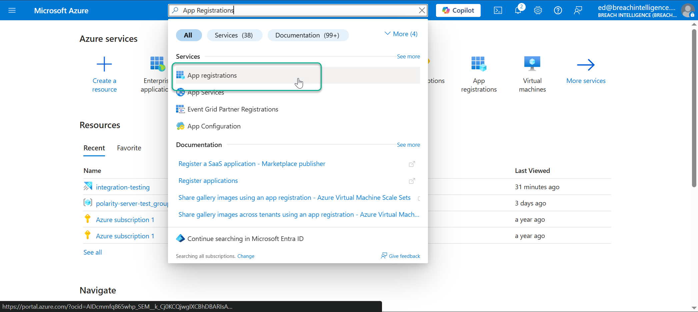
</div>

**2**. Select `New registration`
<div style="margin-bottom: 10px;">

</div>

**3**. Add a memorable name for the new registration then click `Register`
<div style="margin-bottom: 10px;">

</div>

**4**. Navigate to your newly created app registration, then copy the `Application (client) ID` & `Directory (tenant) ID` to the relevant Polarity User Options
<div style="margin-bottom: 10px; display: flex; justify-content: space-between; align-items: flex-start;">
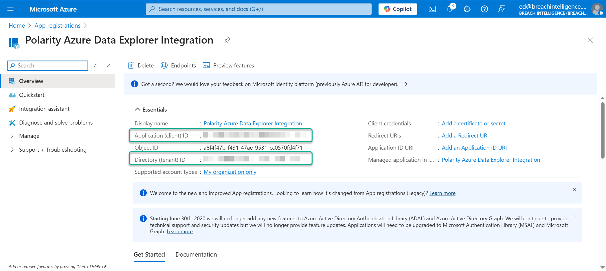
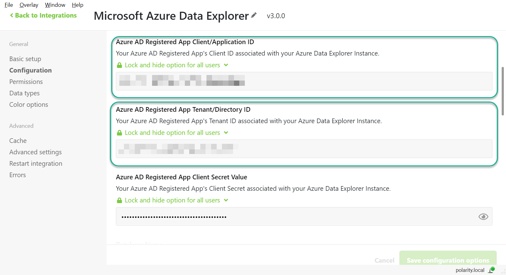
</div>

**5**. Click the `Add certificate or secret` link
<div style="margin-bottom: 10px;">
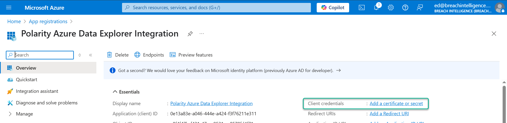
</div>

**6**. Click `New client secret`
<div style="margin-bottom: 10px;">
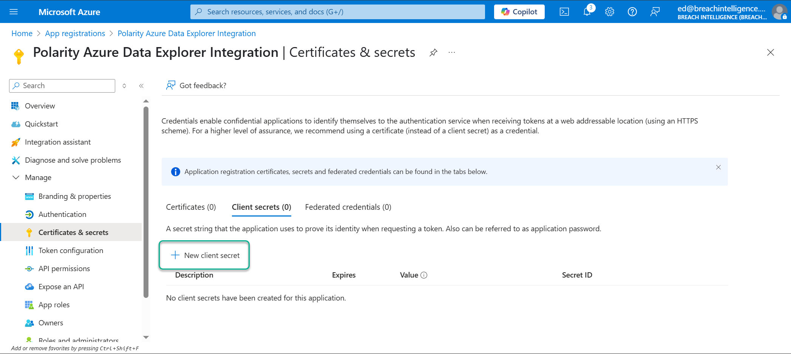
</div>

**7**. Add your desired secret key description then click `Add`
<div style="margin-bottom: 10px;">
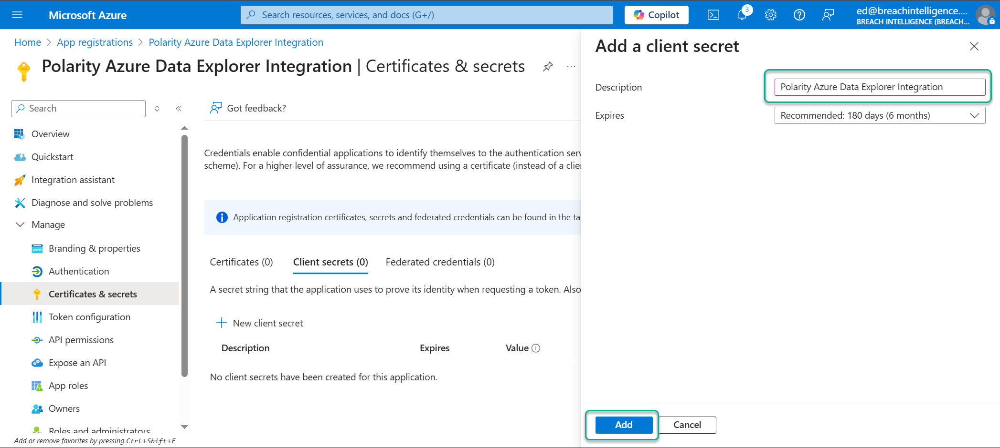
</div>

**8**. Copy your new client secret `Value` (**Not Secret ID**) to the `Azure AD Registered App Client Secret Value` option in the integration.
<div style="margin-bottom: 10px; display: flex; justify-content: space-between; align-items: flex-start;">
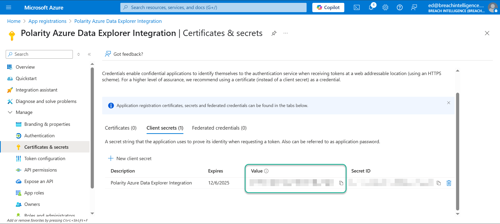
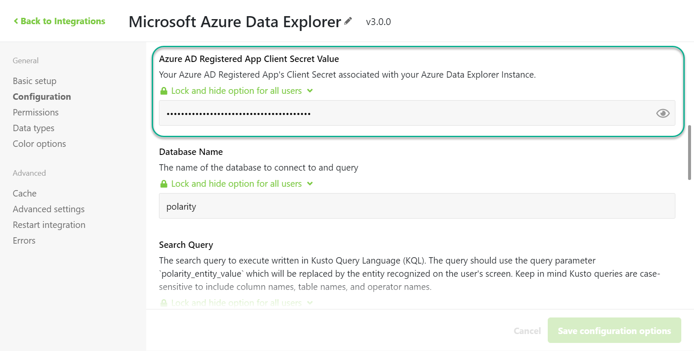
</div>

### _Add App Registration to Cluster Permissions_

Once you have set up your Enterprise Application and have credentials for it, you will need to add this application to your cluster with "View" access.

**1**. Under your cluster settings, navigate to the `Security + Networking` -> `Permissions` page.
<div style="margin-bottom: 10px;">
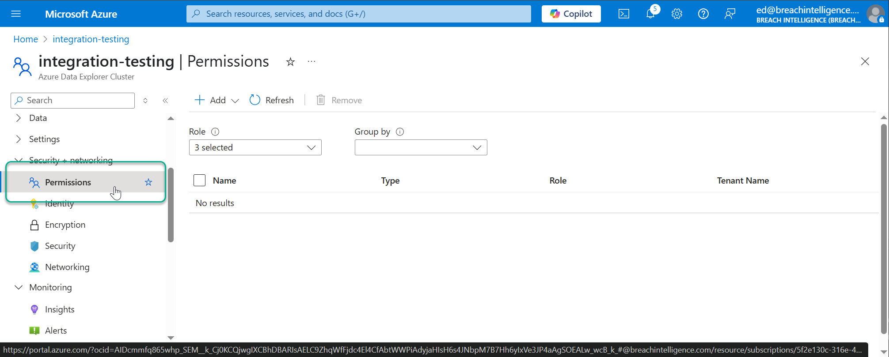
</div>

**2**. Click `Add` -> `AllDatabasesViewer` to add a new database viewer to your cluster.
<div style="margin-bottom: 10px;">
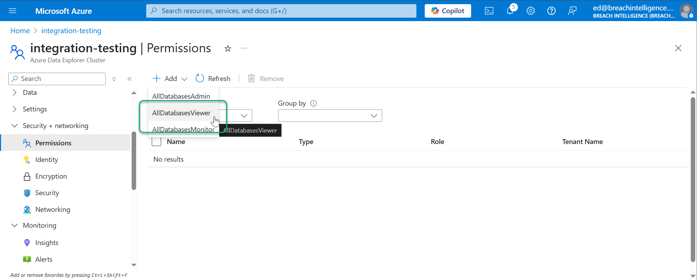
</div>

**3**. Click on `Enterprise Applications` and then filter for your Polarity application that you previously registered.
<div style="margin-bottom: 10px;">
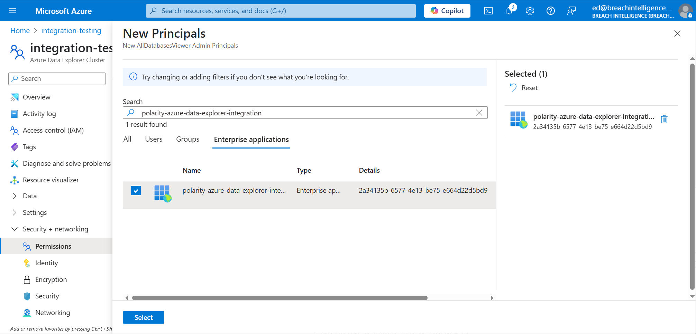
</div>

**4**. After clicking `select` you should see the permission assigned
<div style="margin-bottom: 10px;">
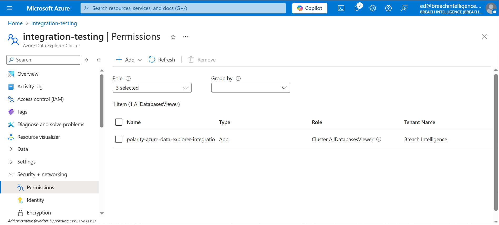
</div>

## Installation Instructions

Installation instructions for integrations are provided on the [PolarityIO GitHub Page](https://polarityio.github.io/).

## Polarity

Polarity is a memory-augmentation platform that improves and accelerates analyst decision making.  For more information about the Polarity platform please see:

https://polarity.io/
